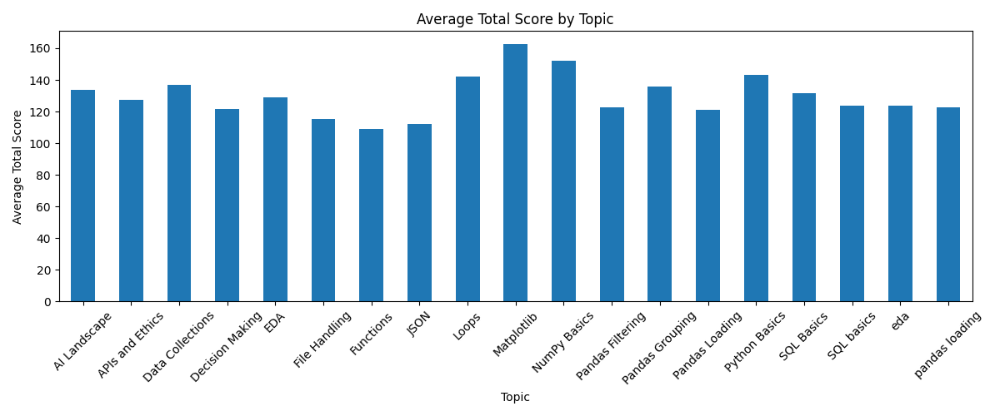
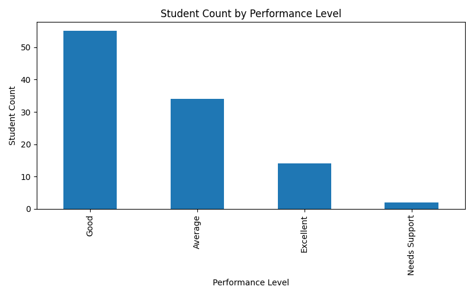
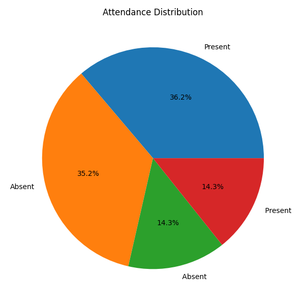
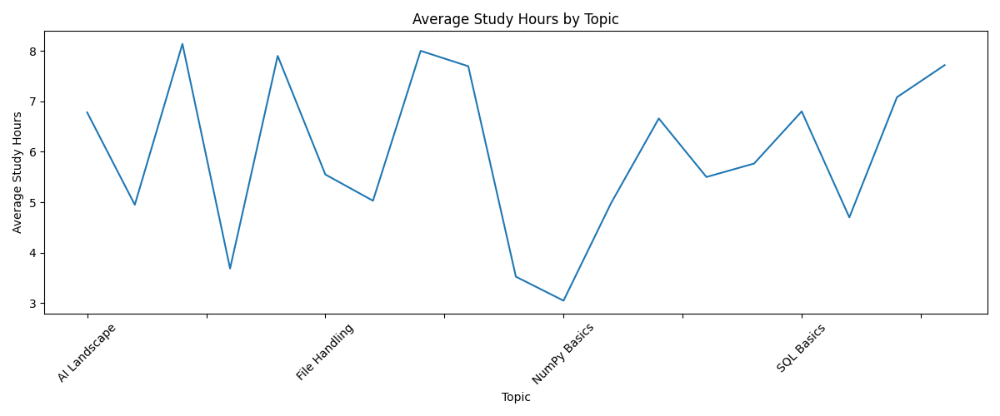

# AI Learning Lab Analysis

## Overview

AI Learning Lab Analysis is an end-to-end data analytics project developed using Python, Pandas, Matplotlib, and SQLite. The project demonstrates the complete data analysis workflow including data exploration, cleaning, transformation, visualization, reporting, and SQL-based analysis.

The objective of this project is to analyze student learning data, identify patterns in performance and attendance, generate visual insights, and store the processed data in a relational database for further analysis.

---

## Technologies Used

* Python
* Numpy
* Pandas
* Matplotlib
* SQLite3
* JSON

---

## Project Workflow

### Task 1: Data Exploration

Performed Exploratory Data Analysis (EDA) on the raw dataset.

Key Operations:

* Loaded dataset using Pandas
* Checked dataset dimensions
* Displayed first few records
* Examined column names and data types
* Identified missing values
* Detected duplicate rows
* Analyzed attendance and topic distributions

---

### Task 2: Data Cleaning

Prepared the dataset for analysis.

Key Operations:

* Removed duplicate records
* Trimmed unnecessary spaces
* Standardized text formatting
* Handled invalid numerical values
* Replaced missing values using:

  * Mean Imputation
  * Median Imputation

Output:

* `cleaned_ai_learning_lab.csv`

---

### Task 3: Data Analysis

Generated meaningful insights from the cleaned dataset.

Key Operations:

* Created Total Score metric
* Categorized student performance levels
* Calculated average scores
* Topic-wise analysis
* Batch-wise analysis
* Identified students requiring academic support

---

### Task 4: Data Visualization

Created visual reports to better understand the dataset.

Generated Charts:

* Average Total Score by Topic
* Student Count by Performance Level
* Attendance Distribution
* Average Study Hours by Topic

Generated Files:

* `topic_score_chart.png`
* `performance_level_chart.png`
* `attendance_chart.png`
* `study_hours_chart.png`

---

### Bonus Task: SQL Analysis

Integrated SQLite database functionality.

Database:

* `learning_lab.db`

Table:

* `student_learning`

SQL Queries Executed:

1. Average Assignment Score by Topic
2. Student Count by Batch
3. Students with Total Score Below 80

---

## Project Structure

```text
AI-Learning-Lab-Analysis/
│
├── ai_learning_lab.csv
├── cleaned_ai_learning_lab.csv
│
├── task1_load_explore.py
├── task2_clean_data.py
├── task3_analyze_data.py
├── task4_visual_report.py
├── bonus_sql_analysis.py
│
├── topic_score_chart.png
├── performance_level_chart.png
├── attendance_chart.png
├── study_hours_chart.png
│
├── learning_summary.json
├── learning_lab.db
│
└── README.md
```

---

## Sample Visualizations

### Average Total Score by Topic



### Student Count by Performance Level



### Attendance Distribution



### Average Study Hours by Topic



---

## Key Insights Generated

* Identified performance trends across topics.
* Compared student performance across batches.
* Measured attendance distribution.
* Analyzed study habits through study-hour metrics.
* Detected students requiring additional support.
* Demonstrated SQL-based reporting and aggregation.

---

## Skills Demonstrated

* Data Cleaning
* Exploratory Data Analysis (EDA)
* Data Visualization
* SQL Querying
* Database Management
* Statistical Analysis
* Python Programming
* Pandas
* Matplotlib
* SQLite

---

## Learning Outcomes

Through this project, I gained practical experience in:

* Real-world data preprocessing
* Missing value handling techniques
* Feature engineering
* Data visualization best practices
* SQL database integration
* Analytical thinking and reporting

---

## Author

**Mahika Bommana**

B.Tech Computer Science Engineering (AIML)
MLR Institute of Technology

GitHub: https://github.com/mahika74
